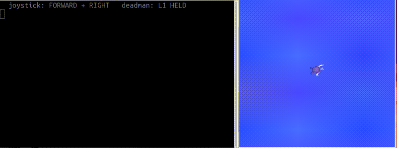
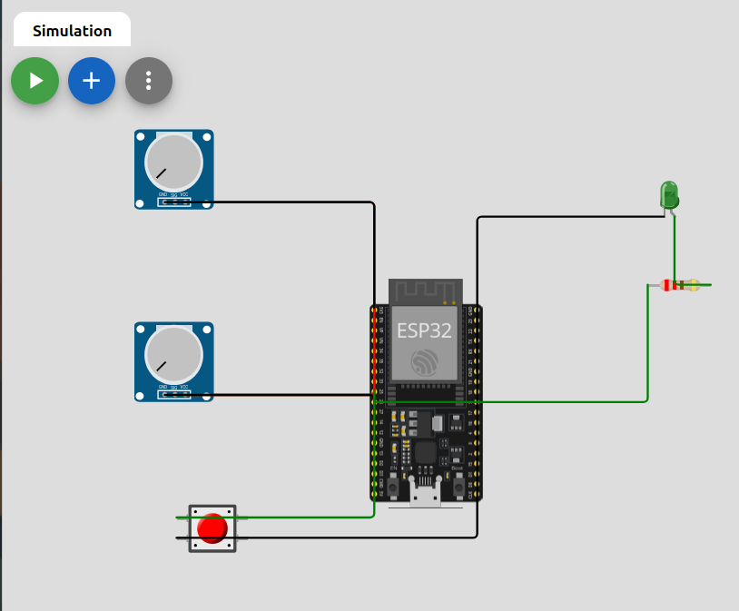

# TeleBridge

**Fail-safe remote teleoperation for ROS 2 robots over MQTT.**

TeleBridge lets you drive a ROS 2 robot from a joystick that is not on the
robot's network, safely. A bridge node receives joystick commands as JSON over
MQTT, validates them, enforces the robot's own speed limits, and stops the robot
the instant the link becomes unhealthy. Two operator devices are included, a
physical game controller and a simulated ESP32, and the same bridge drives both
without changing a line.

    Operator (pick one)              MQTT broker            ROS 2 bridge (C++)
    physical joystick, or   -- cmd JSON     -->             validate, clamp
    Wokwi ESP32             -- heartbeat    -->             5 fallback checks
    state shown to operator <-- state JSON  <--             Twist on /cmd_vel @ 20 Hz

## Background: ROS 2, MQTT, and why a bridge

**ROS 2** is the standard framework for building robot software. Sensors,
controllers and actuators are separate programs (nodes) that exchange messages
over named topics. A mobile robot listens for velocity commands on a topic
called /cmd_vel, so anything that publishes to /cmd_vel can drive it. ROS 2
handles discovery and transport automatically through a system called DDS, which
is excellent on a single robot or a local network.

**MQTT** is a lightweight publish/subscribe messaging protocol built for the
internet and for constrained devices. Publishers send messages to topics on a
central broker, and subscribers receive them, without the two ever knowing about
each other directly. It is the common language of IoT sensors and
microcontrollers because it is small, tolerant of unreliable links, and works
across networks.

**Why a bridge between them?** DDS, which ROS 2 relies on, does not travel
across the internet. It uses network discovery that home routers, mobile
networks, VPNs and cloud NAT routinely block, so two ROS 2 machines on different
networks usually cannot see each other at all. MQTT was designed for exactly
that situation. A bridge that speaks MQTT on one side and ROS 2 on the other lets
an operator anywhere on the internet drive a robot, using the same protocol that
sensors and embedded devices already use. It joins the world of small networked
devices to the world of ROS robots.

## Why both a simulator and a real joystick?

The two operators show the same idea from two angles.

The **simulated ESP32** (running in Wokwi, needing no hardware) represents the
embedded case: a small, low-power microcontroller reading sensors, exactly the
kind of device MQTT was built for. Anyone can open it in a browser and run it,
which makes the project reproducible without buying anything.

The **physical joystick** represents the desktop case: a full operator station
with a real game controller. It also proves the point that matters most, that
the robot side does not care what the operator is. The same bridge, with no
changes, was driven first by the simulated ESP32 and then by a real DualSense.
The operator device is interchangeable because both sides agree only on a
message contract, not on any particular hardware.

That interchangeability is the whole argument for a bridge: build the safety and
control logic once, on the robot side, and let any operator device that can
produce the JSON drive the robot.

## Why state feedback matters

In remote operation the operator often cannot see the robot directly. That
changes what "safe" means. If the robot simply stops, the operator has no way of
knowing why, whether their own connection dropped, whether they released the
control, or whether the robot itself failed.

TeleBridge sends a state message back to the operator continuously, reporting
whether it is in remote control or fallback, and naming the reason. When the
robot stops, the operator sees precisely why: link lost, command stale,
heartbeat missing, or deadman released. This closes the loop. Remote operation
without feedback is driving blind; the return channel is what makes it operation
rather than guesswork.

## Safety notice

This is a learning prototype, not safety-rated software. It has no
authentication, no encryption, and no independent emergency stop, and has only
been tested against simulators. Do not use it to control physical machinery
capable of causing injury or damage. If you adapt it for real hardware, the
deadman must be backed by an independent hardware e-stop that does not depend on
this software, the network, or the broker.

## Layout

    operator_joystick/    Python operator: reads /joy, publishes command JSON
                          (joy_operator.py drives; joy_monitor.py is a display)
    operator_esp32/       Wokwi ESP32 operator (sketch.ino, diagram.json)
    ros2_ws/src/remote_robot_bridge/   the C++ bridge node

## 1. Build the bridge

Build and run the bridge:

    sudo apt install -y libmosquitto-dev nlohmann-json3-dev
    cd ros2_ws
    colcon build
    source install/setup.bash
    ros2 run remote_robot_bridge mqtt_bridge

## 2. Operator A: physical joystick

Tested with a Sony DualSense over USB.

    sudo apt install -y ros-jazzy-joy python3-paho-mqtt
    ros2 run joy joy_enumerate_devices                          # find your device id
    ros2 run joy joy_node --ros-args -p device_id:=0 -p deadzone:=0.15
    python3 operator_joystick/joy_operator.py

Left stick drives, L1 is the deadman and must be held. Axis and button indices
are constants at the top of joy_operator.py; verify yours with
`ros2 topic echo /joy --once` and adjust.

## 3. Operator B: simulated ESP32 (no hardware)

Open https://wokwi.com, create an ESP32 project (Arduino template), and use the
three files from operator_esp32/. Two potentiometers are the joystick axes, the
red pushbutton is the deadman, the green LED lights only while the robot confirms
remote control.

## 4. Drive something

Any /cmd_vel consumer works. Turtlesim:

    sudo apt install -y ros-jazzy-turtlesim
    ros2 run turtlesim turtlesim_node
    ros2 run remote_robot_bridge mqtt_bridge --ros-args -r /cmd_vel:=/turtle1/cmd_vel

Hold the deadman and drive. Release it mid-motion and the robot stops within one
control tick; kill the operator entirely and it stops within one second.

## 5. Configuration

Both operator and bridge must agree on the broker and robot ID.

    Broker      operator BROKER constant / bridge mosquitto_connect(...)
                default broker.hivemq.com:1883
    Robot ID    topic strings on both sides, default robotthinkit
    Limits      0.5 m/s and 1.0 rad/s, clamped on the robot side
    Timeout     1000 ms against 10 Hz commands and 4 Hz heartbeats

The public broker means anyone can publish to your topics; use a unique robot ID
and treat this as a lab setup, not a deployment.

### Adjusting speed

The robot enforces its own limits, so speed is capped in two places and the
lower value wins. To drive faster, raise both.

In operator_joystick/joy_operator.py:

    MAX_LIN = 0.5    # increase for faster forward and back
    MAX_ANG = 1.0    # increase for faster turning

And the clamp in ros2_ws/src/remote_robot_bridge/src/mqtt_bridge_node.cpp:

    if (lin >  0.5) lin =  0.5;   // raise these four limits to match
    if (lin < -0.5) lin = -0.5;
    if (ang >  1.0) ang =  1.0;
    if (ang < -1.0) ang = -1.0;

Keeping the clamp on the robot side is deliberate: the robot never trusts the
operator to send sane values, so the final limit lives with the robot.

## 6. The safety design

The bridge publishes /cmd_vel continuously at 20 Hz. Every tick re-evaluates
five conditions, and the first failure names the reason reported back to the
operator: MQTT disconnected, no command yet, command older than 1 s, heartbeat
older than 1 s, invalid command JSON, deadman released. Only if all pass are the
clamped joystick values forwarded; otherwise the robot receives explicit zeros.
The fallback state is also the initial state: at boot the robot has no evidence
anyone is in control, so it is stopped.

## 7. Where this could go

This is a foundation, not a finished product. Because the operator and robot are
decoupled by a message contract, the same bridge could sit under much larger
systems. The pattern, a networked operator, a transport that crosses networks,
and a robot-side safety layer that fails to a stop, is the basis of any serious
remote or supervised operation. What gets built on top of it is left open on
purpose; the point of this repository is the safe, reusable core.

## Learn more

- [ROS 2](https://docs.ros.org)
- [MQTT protocol](https://mqtt.org)
- [Eclipse Mosquitto (MQTT broker)](https://mosquitto.org)
- [HiveMQ public broker](https://www.hivemq.com/mqtt/public-mqtt-broker/)
- [Wokwi ESP32 simulator](https://wokwi.com)

## License

MIT. See LICENSE.